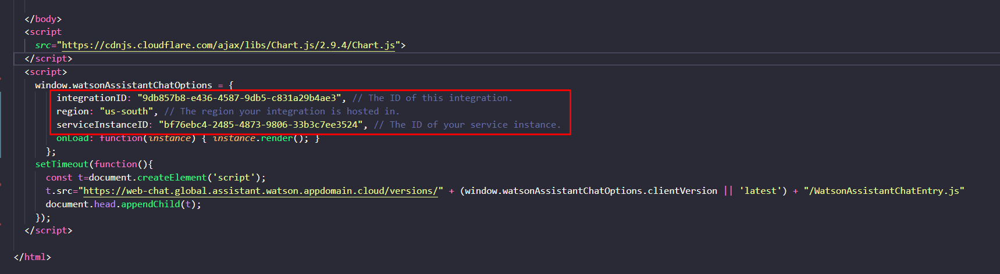
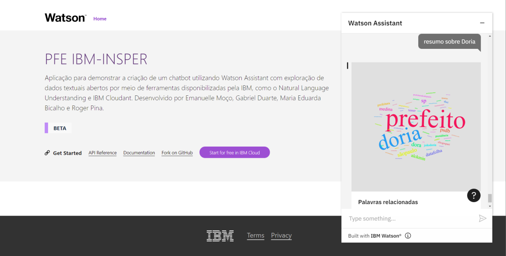

# Aplição obtida

A ultima etapa do aplicativo sera a interface do App.

Passo 1: Clone o [repositório](https://github.com/PFE-INSPER/client-app.git)

`$ git clone https://github.com/PFE-INSPER/client.git`

Passo 2: Altere as credencias do Watson Assistant

No arquivo [index.html](https://github.com/PFE-INSPER/client/blob/main/public/index.html) altere as seguintes credenciais

Passo 3: Rode localmente

`$ npm install`

`$ npm start`

No fim deste tutorial, você terá uma aplicação como a seguir:

