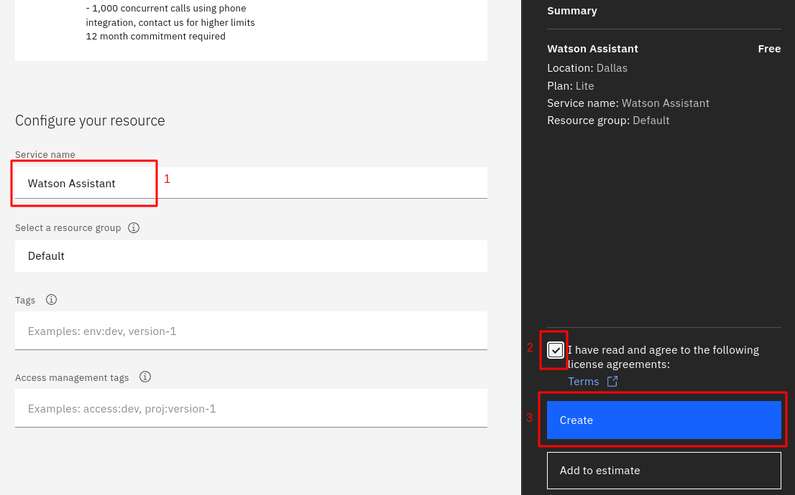

# Watson Assistant

## O que é o  [Watson Assistant](https://www.ibm.com/br-pt/products/watson-assistant?utm_content=SRCWW&p1=Search&p4=43700056969895161&p5=e&gclid=CjwKCAiAnO2MBhApEiwA8q0HYQ-yPsWaYbURUvkdpin0LRJwzJTd9kM0hYYeZxeXYo04whO0-E37NBoCF1kQAvD_BwE&gclsrc=aw.ds)?
Ferramenta de construção de chatbots que utiliza inteligência artificial para simular uma conversação humana com o usuário.
A plataforma permite a criação de interfaces de conversação em diferentes dispositivos e aplicativos.
Este toturial irá abordar construção de um chatbot transacional, ou seja, ele consulta informações dentro de uma base de dados para responder ao usuário.

## Criando uma instância do Watson Assistant
* No Dashboard do IBM Cloud clique em `Create Resource`
* Selecione o Watson Assistant
* Selecione uma localidade (ou deixe a padrão)  
* Selecione o plano de serviço Free  
* Service name: `Watson Assistant`  
* Aceite os termos de serviço
* Clique em `Create`

* Clique em `Launch Watson Assistant`

!!! Note
    Salve a `API key` e `URL` para uso posterior

* Assistant name: `ProjetoPFE`
* Assistant language: `Brazilian Portuguese`
* Clique em `Create assistant`

* Vá na aba de Skills
* Clique em `Create Skill`
* Selecione `Add an actions or dialog skill` 

* Clique na aba `Upload skill`
* Adicione o arquivo [skill-Assistant](https://github.com/Insper/pfe_ibm_2021_2/blob/main/scripts/skill-Assitant.json)
* Clique em `Upload`

## Intents, entities e dialogs
Para a construção do chatbot, é necessário definir intents, entidades e dialogs. Essa estruturação para a formação dos diálogos pode ser configurada de duas maneiras:  

* Manualmente pelo dashboard do Watson Assistant
* Por meio de um aquivo em formato JSON que contém as intents, entities e dialogs. 
 
Para este tutorial, as intent, entities e dialogs já foram disponibilizadas pelo arquivo [skill-Assitant](https://github.com/Insper/pfe_ibm_2021_2/blob/main/scripts/skill-Assitant.json).

É imoprtante entender o que cada uma das partes representa:  

* Intent: Representa a intenção do usuário. Uma intent deve possuir no mínimo entre quinze a vinte exemplos de perguntas que podem ser feitas por um usuário quando quer descobrir uma determinada informação.  
* Entities:  Algum objeto ou termo relavante para fornecer contexto as intenções, como por exemplo dia, horário, local e pessoa.   
* Dialogs: conectam as intents e as entities com as possíveis respostas que o  chatbot deve dar para as mesmas, permitindo, como já diz o nome, a construção real do diálogo.  

Fuzzy matching: true
Funcionalidade que permite que o Watson Assistant identifique e compreenda palavras com pequenos erros.

## Criando uma integração
Existem várias maneiras de integrar o chatbot criado na sua aplicação, como whatsap  telegram.
N   este tutorial foi optado por utilizar a versão Embed.  

* Escolha o projeto criado na página do Assistant
* No menu lateral em `Integrations`, clique em `Add Integration`

* Escolha a opção `Web chat`

* Intregation name: Assistente de Notícias
* Clique em `Create`

* Customize a interface da maneira que preferir. 
* Salve o código disponível em Embed para usar posteriormente na aplicação. 

* Clique em `Save and exit`

## Configurando Webhooks
Webhook é um mecanismo que permite realizar uma chamada externa, aqui será feito uma conexão com o servidor criado. 

!!! Note
    Após criar o servidor, é necessário colocar a URL para configurar o Webhook.

!!! Warning
    Ao copiar o endpoint do servidor, é necessário colocar `.json` no final.
