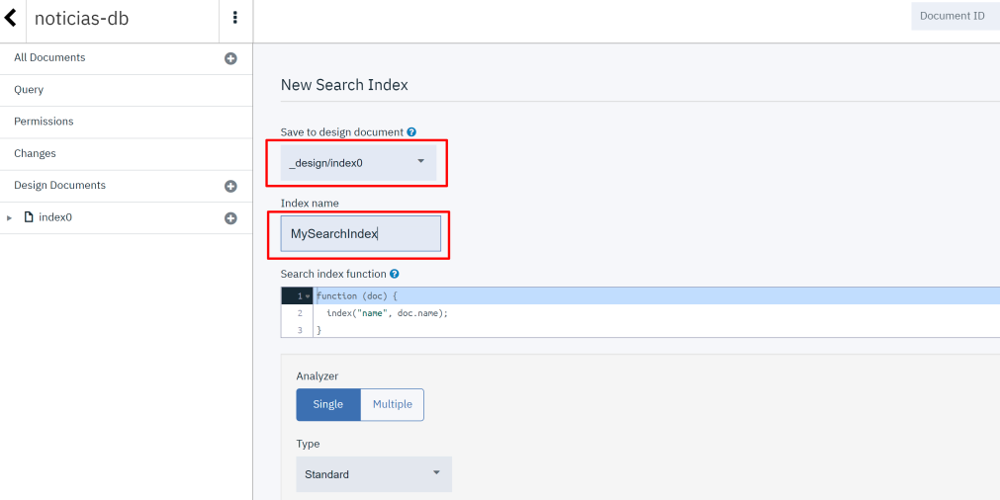

# Cloudant

## O que é o [Cloudant](https://www.ibm.com/br-pt/cloud/cloudant)
IBM cloudant é um serviço de armazenamento de dados em formato JSON na nuvem que funciona de maneira escalável e distribuída. 

## Criando uma instância do Cloudant
* No Dashboard do IBM Cloud, clique em `Create Resource`

* Selecione o Cloudant 

* Escolha uma localização (ou deixe a padrão)
* Instance name: Cloudant-noticias
* Clique em `Create` 
 


## Criando um banco de dados
* Clique em `Create Database`
* Database-name: noticias-db


## Adicionando documentos na base de dados
O dataset escolhido para este tutorial é o [News of the Brazilian Newspaper](https://www.kaggle.com/marlesson/news-of-the-site-folhauol) que contém mais de 160 mil notícias da Folha de S. Paulo entre o período de Janeiro de 2015 até Setembro de 2017. 
Faça o download e coloque o arquivo CSV na pasta [scripts](https://github.com/PFE-INSPER/tutorial/tree/main/scripts).

No arquivo [Cloudant.ipynb](https://github.com/PFE-INSPER/tutorial/blob/main/scripts/Cloudant.ipynb) coloque as chaves da sua instância, o id do modelo salvo anteriormente e rode as celulas.

O script irá criar na pasta [dados](https://github.com/PFE-INSPER/tutorial/tree/main/dados) um arquivo JSON para cada notícia analisada.

!!! Note
    Disponibilizamos 100 arquivos na pasta [dados](https://github.com/PFE-INSPER/tutorial/tree/main/dados) para você verificar o seu modelo.


!!! Importante
    Para utilizar o NLU Lite, você precisará recriar o modelo e subir os arquivos de maneira particionada, até atingir o limite e repetir o mesmo passo até finalizar. 
    Com um plano plus é possível realizar esta operação em apenas uma sessão.) 


## Criando uma Search Index
Search Index são ferramentas que permitem realizar buscas em uma  base de dados.
Elas utilizam um ou mais campos da sua base para:    

  * Rodar Queries
  * Encontrar documentos a partir de um contexto 
  * Trabalhar com grupos ou pesquisas de localizações.

Neste tutorial está sendo uzado uma Search Index para encontrar os enrichments criados pelo NLU nos arquivos da base de dados. Com a Search Index é possível retornar para o servidor, mandando as respostas que irão para o Assistante e serão visualizadas pelo usuário.

- Dentro do database criado noticias-db clique na aba `Design Documents` > `New Search Index`


- Selecione o seu documento e dê um nome para a sua search index


Na parte da function, coloque o que deseja retornar. No caso deste projeto, retornamos o texto, título, data, link, classificação, categoria e enriquecimentos.

``` JavaScript
function (doc) {
  index("default", doc.text + ' ' + doc.title);
  if (doc.text) {
    index("text", doc.text, {"store": true, "facet": false});
  }
  if (doc.title) {
    index("title", doc.title, {"store": true, "facet": false});
  }
  if (doc.enrichments) {
    index("enrichments", JSON.stringify(doc.enrichments), {"store": true});
  }
  if (doc.date) {
    index("date", doc.date, {"store": true});
  }
  if (doc.classification) {
    index("classification", JSON.stringify(doc.classification), {"store": true});
  }
  if (doc.link) {
    index("link", doc.link, {"store": true});
  }
  if (doc.category) {
    index("category", doc.category, {"store": true});
  }
}
```

Salve seu documento. 

!!! Tip
    Você pode testar o retorno da sua função na aba Search Indexes > AllData e entre com a sua query.

Para a proxima etapa voce vai precisar da API key e da URL do Cloudant. Para obter essas credenciais vá para a aba Service credentials e clique em "New credential".


Em seguida selecione a opção "Auto-generated service credentials" e clique em "Add"


Por fim suas credencias estarão disponiveis para copiar ou fazer download. 