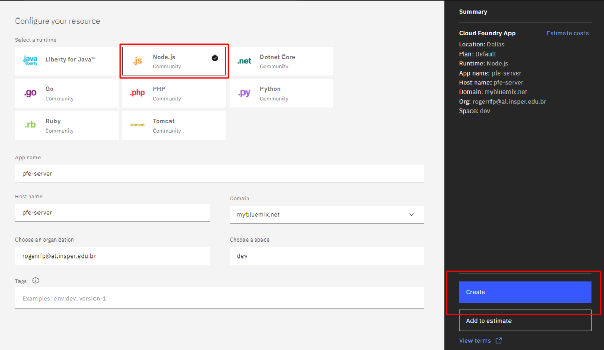

# Cloud Foundry

## O que é o [Cloud Foundry](https://www.ibm.com/br-pt/cloud/cloud-foundry)

O Cloud Foundry é o servidor do nosso projeto, ele possibilita uma interação rápida entre os produtos da IBM Watson além de gerenciar o acesso e a capacidade do usuário nos servidores. Nesse projeto, ele esta hospedando o servidor criado com Node que foi utilizado para fazer a conexão entre o nosso banco de dados no Cloudant e o Watson Assistant.

## Criando uma instância no Cloud Foundry 

* No Dashboard do IBM Cloud, clique em `Create Resource` e escolha `Cloud Fundry`
* Clique em `Create`

* Escolha Node.js e clique em `Create` 

* No github criado automaticamente adicione o [github do projeto](https://us-south.git.cloud.ibm.com/gabrielmd/NodejsExpressAppHNTKU2021-09-17/-/tree/master).

Para o proximo passo é necessario ter instalado as seguintes ferramentas:

* [IBM Cloud CLI](https://cloud.ibm.com/docs/cli?topic=cli-install-ibmcloud-cli)
* [git](https://git-scm.com/downloads)
* [node](https://nodejs.org/en/) 

Passo 1: Clonar [repositório](https://github.com/PFE-INSPER/pfe-server.git) 

`$ git clone https://github.com/PFE-INSPER/pfe-server.git`

Passo 2: Alterar credenciais do Cloudant

No arquivo [pfe-controller.js](https://github.com/PFE-INSPER/pfe-server/blob/main/server/controllers/pfe-controller.js) altere as credenciais para as suas como mostra a figura abaixo

Passo 3: Fazer o deploy da aplicação

 `$ ibmcloud login`

 `$ ibmcloud target --cf`

 `$ ibmcloud cf push`

Passo 4: Link para aplicação

* Clique em `Visit App URL` na página do *dashboard* seu servidor

Salve o link da aplicação para utilizá-lo na confiruação do Webhook do Watson Assistant no próximo passo.