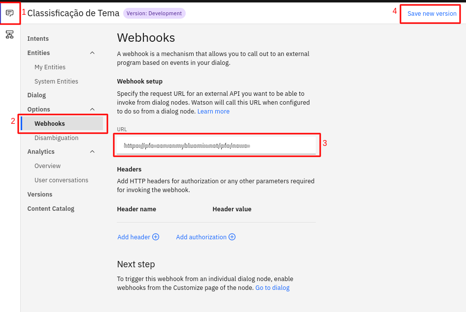

# Cloud Foundry

## O que é o [Cloud Foundry](https://www.ibm.com/br-pt/cloud/cloud-foundry)?

O Cloud Foundry é o servidor do nosso projeto, ele possibilita uma interação rápida entre os produtos da IBM Watson além de gerenciar o acesso e a capacidade do usuário nos servidores. Nesse projeto, ele esta hospedando o servidor criado com Node que foi utilizado para fazer a conexão entre o nosso banco de dados no Cloudant e o Watson Assistant.

## Criando uma instância no Cloud Foundry 

* No Dashboard do IBM Cloud, clique em `Create Resource` e escolha `Cloud Fundry`
* Clique em `Create`

* Escolha Node.js e clique em `Create` 

* No github criado automaticamente adicione o [github do projeto](https://us-south.git.cloud.ibm.com/gabrielmd/NodejsExpressAppHNTKU2021-09-17/-/tree/master).

*  Como mencionado anteriormente, no webhooks criado no  Assistant, substitua o link pelo do seu servidor criado aqui.

importante ter conta na ibm cloud , cli
git
node 

Passo 1: nosso git
e segue os passos seguintes da documentação do IBM Cloud

https://cloud.ibm.com/apps/da4869d3-5dc0-4a2f-b028-6149448708f2?ace_config=%7B%22region%22%3A%22us-south%22%2C%22crn%22%3A%22crn%3Av1%3Abluemix%3Apublic%3Acf%3Aus-south%3As%2Fe44cd71a-b8dc-41ed-a93a-bdbd27e03af0%3A%3Acf-application%3Ada4869d3-5dc0-4a2f-b028-6149448708f2%22%2C%22resource_id%22%3A%22da4869d3-5dc0-4a2f-b028-6149448708f2%22%2C%22orgGuid%22%3A%225496591a-8441-45e3-aafe-6f6832c4c0be%22%2C%22spaceGuid%22%3A%22e44cd71a-b8dc-41ed-a93a-bdbd27e03af0%22%2C%22redirect%22%3A%22https%3A%2F%2Fcloud.ibm.com%2Fresources%22%2C%22bluemixUIVersion%22%3A%22v6%22%7D&env_id=ibm%3Ayp%3Aus-south&paneId=startcoding