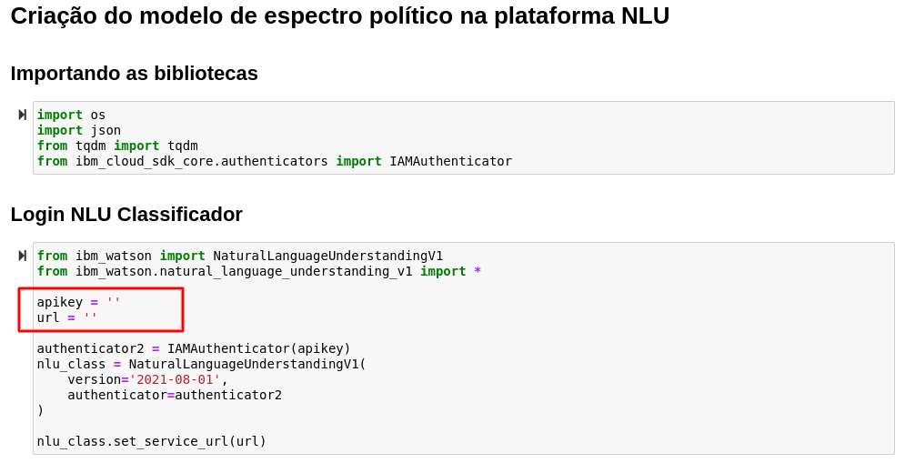

# Enriquecimento dos dados via NLU
Chegou a hora de rodar os dados do [dataset escolhido](https://www.kaggle.com/marlesson/news-of-the-site-folhauol) para aplicar o processo de enriquecimento via NLU agregado ao modelo criado anteriormente. A primeira etapa é o treinamento do modelo.

## Treinamento do Modelo de Polaridade Política

A primeira parte deste tutorial consiste no treinamento de um modelo que analisa o quanto uma notícia tem polaridade política de Esquerda ou de Direita. 
O modelo foi criado utilizando o ferramenta NLU e os dados utilizados para o treinamento foram notícias de jornais políticamente opostos.  
A [Carta Capital](https://cartacapital.com.br) se institula como tendo um viés progressista, sendo alinhada à esquerda política.  
Já a [Jovem Pan](https://jovempan.com.br) foi considerada como sendo alinhada à direita política. 

## Coleta de dados
As notícias utilizadas foram coletadas por meio do script [Treinamento.ipynb](https://github.com/Insper/pfe_ibm_2021_2/blob/main/scripts/Treinamento.ipynb). A biblioteca [Beautiful Soup](https://www.crummy.com/software/BeautifulSoup/bs4/doc/) da linguagem Python foi utilizada para fazer um *web crawl* do *website* de cada um dos jornais escolhidos.
Esse script cria o arquivo [training_data.json](https://github.com/Insper/pfe_ibm_2021_2/blob/main/scripts/training_data.json) que contém os dados de treinamento e será utilizado para a criação do modelo.

!!! Nota
    Os passos seguintes podem ser encontrados no arquivo [Enriquecimento dos Dados.ipynb](https://github.com/Insper/pfe_ibm_2021_2/blob/main/scripts/Enriquecimento%20dos%20Dados.ipynb) e devem ser replicados

## 1. Filtragem do dataset
O dataset é filtrado para remover dados desnecessários e textos muito curtos

## 2. Login NLU

!!! Nota
    * Coloque as chaves de acesso do seu NLU que foi salvada anteriormente nas variáveis de configuração do ambiente 

## 3. Treinamento do Modelo
Para o treinamento e criação do modelo é necessário enviar para o NLU os dados que foram coletados. Ao criar um modelo é obtido o seu `model id` que será utilizado durante o envio dos dados.

## 4. Passando os dados pelo NLU
Nessa etapa é realizao o envio dos dados para o NLU via API. Cada notícia é dividida em partes menores que 1500 caracteres (o NLU tem limite de 2000) e cada parte é enriquecida pelo NLU. 

