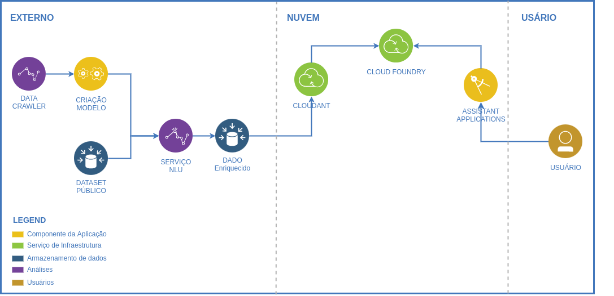

# Tutorial pra criação de um chatbot com análise exploratória utilizando ferramentas da IBM 

<!-- ## Exploração de dados textuais abertos usando IBM Watson -->

Este tutorial tem como intuito realizar a exploração de dados textuais abertos da língua portuguesa usando diversas ferramentas disponibilizadas pela IBM.  

Desenvolvido por [Emanuelle Moço](https://github.com/emanuellemoco), [Gabriel Duarte](https://github.com/), [Maria Eduarda Bicalho](https://github.com/) e [Roger Pina](https://github.com/rogerpina2).

## O que é IBM Watson

O IBM Watson é uma plataforma de Inteligência Artificial da IBM. Ela permite que você crie modelos e utilize ferramentas prontas para melhorar os processos e serviços de clientes.

Para conhecer mais sobre o IBM Watson, acesse [a página da IBM](https://www.ibm.com/br-pt/watson).

## O que é contemplado neste tutorial
* Introdução aos ferramentais utilizados da IBM 
* Tutorial para construção de um chatbot utilizando Natural Language Understanding (NLU) para criação de um modelo por classificação configurável e enriquecimento dos dados 
* Salvar os dados na ferrementa IBM Cloudant
* Integração do chatbot transacional com uma aplicação rodando em Node.js
* Deploy da aplicação utilizando a feramenta Cloud Foundry

!!! Importante
    Clone o repositório [https://github.com/Insper/pfe_ibm_2021_2.git](https://github.com/Insper/pfe_ibm_2021_2.git) 

## Arquitetura
O diagrama abaixo representa a arquitetura utilizada neste tutorial.   

    

<!-- 
## Commands

* `mkdocs new [dir-name]` - Create a new project.
* `mkdocs serve` - Start the live-reloading docs server.
* `mkdocs build` - Build the documentation site.
* `mkdocs -h` - Print help message and exit.

## Project layout

    mkdocs.yml    # The configuration file.
    docs/
        index.md  # The documentation homepage.
        ...       # Other markdown pages, images and other files. -->

<!-- tips do admotion
https://squidfunk.github.io/mkdocs-material/reference/admonitions/#inline-blocks 
-->
