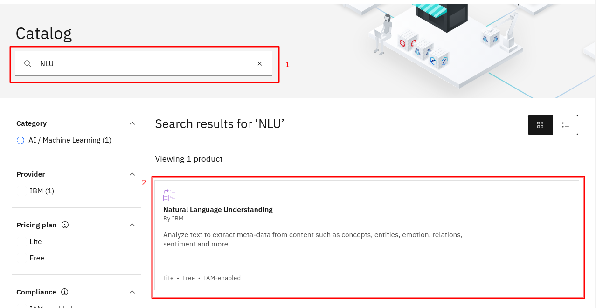
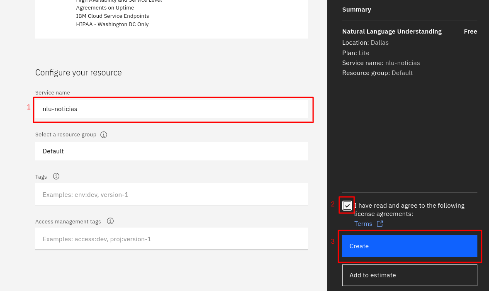
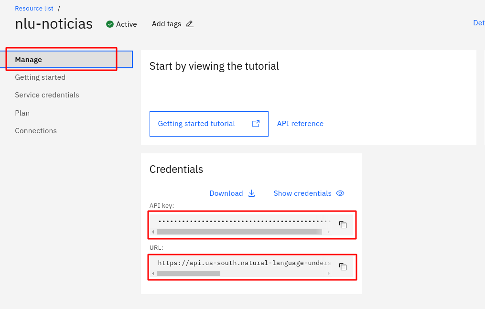

# Natural Language Understanding

## O que é o [Natural Language Understanding](https://www.ibm.com/br-pt/cloud/watson-natural-language-understanding)

O Watson Natural Language Understanding (NLU) é uma ferramenta que permite que o Watson seja capaz de entender o que o usuário está falando, oferecendo processamento de linguagem natural, por meio de deep-learning, para análise de textos não estruturados, aleḿ de extração de *meta-datas* como entidade, palavra-chave, conceitos, sentimento e categoria.  

O NLU também permite a criação de modelos customizáveis desenvolvido através do Watson Knowledge Studio. A partir de um modelo customizado, o NLU pode ser configurado para melhorar a acurácia da extração de dados e para reconhecer padrões de linguagem.

## Utilizações do NLU
Neste tutorial, a ferramenta NLU será utilizada para dois propósitos:    

* Treinamento do modelo por classificação configurável  
* Enriquecimento das informações do dataset

## Criando uma instância do Natural Language Understanding
* No Dashboard do IBM Cloud, clique em Create Resource

* Procure por em Natural Language Understanding 

* Escolha uma localização (ou deixe a padrão)
* Service name: nlu-noticias
* Aceite os termos
* Clique em create 

* Clique em `Manage` e salve  as Credenciais para uso posterior

